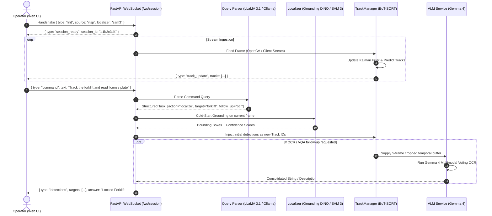

<div align="center">

# ��🛡️ InsightVision (InsightVision-MVP)

### *Vision-Language Empowered Real-Time Object Tracking & Semantic Surveillance*

[](https://insightvision-ai.tech/)
[](https://github.com/SyedBurhanAhmed/InsightVision-MVP)
[](https://www.python.org/)
[](https://fastapi.tiangolo.com/)
[](https://react.dev/)
[](https://pytorch.org/)
[](https://developer.nvidia.com/cuda-toolkit)
[](LICENSE)

<p align="center">
  <b>InsightVision</b> is an enterprise-grade, multimodal "Talk-to-Camera" intelligence platform. It bridges high-speed multi-object tracking (<b>BoT-SORT</b>) with zero-shot open-vocabulary localization (<b>Grounding DINO / SAM 3</b>) and fine-grained visual-language reasoning (<b>Google Gemma 4 / Groq LLaMA 3.1</b>) to enable natural-language surveillance across live camera feeds, uploaded videos, and RTSP streams.
</p>

[**Explore Live Demo »**](https://insightvision-ai.tech/) · [**Architecture Report »**](docs/architecture_audit.md) · [**Report Issue »**](https://github.com/SyedBurhanAhmed/InsightVision-MVP/issues)

</div>

---

## 📑 Table of Contents

- [Overview & Core Architecture](#-overview--core-architecture)
- [Key Features & Capabilities](#-key-features--capabilities)
- [System Pipeline Flow](#-system-pipeline-flow)
- [Technology Stack](#-technology-stack)
- [Hardware & Environment Requirements](#-hardware--environment-requirements)
- [Getting Started & Local Installation](#-getting-started--local-installation)
  - [Prerequisites](#prerequisites)
  - [1. Clone Repository](#1-clone-repository)
  - [2. Backend Setup](#2-backend-setup)
  - [3. Frontend Setup](#3-frontend-setup)
- [Docker Deployment](#-docker-deployment)
- [Environment Configuration (`.env`)](#-environment-configuration-env)
- [API & WebSocket Specification](#-api--websocket-specification)
  - [REST Endpoints](#rest-endpoints)
  - [WebSocket Live Protocol (`/ws/session`)](#websocket-live-protocol-wssession)
- [Project Directory Structure](#-project-directory-structure)
- [Evaluation & Benchmarks](#-evaluation--benchmarks)
- [Ethics & Privacy Statement](#-ethics--privacy-statement)
- [Project Team & Acknowledgments](#-project-team--acknowledgments)

---

## 🔭 Overview & Core Architecture

Traditional surveillance pipelines force an operational compromise: either rely on fast, closed-vocabulary detectors (e.g., YOLO) with rigid classes, or deploy heavy Vision-Language Models (VLMs) that bottleneck frame rates down to unusable latencies (1–3 FPS).

**InsightVision solves this through an Asynchronous Split-Pipeline Architecture:**

1. **Cold-Start Target Localization**: When an operator issues a natural-language query (*"Track the person with orange safety vest"*), the system executes an open-vocabulary grounding step using **Grounding DINO** or **SAM 3 Prompt Processor** once on the keyframe.
2. **Real-Time Track Hand-off**: The localized bounding boxes are immediately passed to **BoT-SORT** (with Kalman filtering and Camera Motion Compensation via BoxMOT). Frame-by-frame tracking proceeds at 30+ FPS without re-evaluating heavy neural backbones.
3. **On-Demand VLM Multi-Frame Inspection**: Detailed queries (*"Read the ID on the badge"* or *"Describe the vehicle logo"*) sample multiple cropped target frames and execute **Google Gemma 4** (`google/gemma-4-E2B-it`) with majority-voting confidence aggregation.

```
                    ┌──────────────────────────────────────────────────────────┐
                    │                   USER / OPERATOR UI                     │
                    │      (React 19 + TypeScript + Cyberpunk Dashboard)       │
                    └─────────────────────────────┬────────────────────────────┘
                                                  │ Natural Language Command
                                                  │ ("Track the courier in red")
                                                  ▼
                    ┌──────────────────────────────────────────────────────────┐
                    │            NATURAL LANGUAGE QUERY PARSER                 │
                    │        (Groq LLaMA 3.1-8B-Instant / Local Ollama)        │
                    └─────────────────────────────┬────────────────────────────┘
                                                  │ Structured Task JSON
                                                  ▼
      ┌───────────────────────────────────────────────────────────────────────────────────────────┐
      │                                FASTAPI BACKEND ORCHESTRATION                              │
      │                                                                                           │
      │  ┌─────────────────────────┐   Initial BBoxes   ┌──────────────────────────────────────┐  │
      │  │ COLD-START LOCALIZER    │ ─────────────────> │ REAL-TIME TRACK MANAGER              │  │
      │  │ • Grounding DINO Swin-T │                    │ • BoT-SORT / ByteTrack (BoxMOT)      │  │
      │  │ • SAM 3 Prompt Grounder │                    │ • Kalman Filter + Motion Comp        │  │
      │  └─────────────────────────┘                    │ • Persistent Target ID Maintenance   │  │
      │               │                                 └──────────────────┬───────────────────┘  │
      │               │                                                    │ Track Crops          │
      │               ▼                                                    ▼                      │
      │  ┌─────────────────────────┐                    ┌──────────────────────────────────────┐  │
      │  │ INSTANCE SEGMENTATION   │                    │ ON-DEMAND MULTIMODAL READER / VQA    │  │
      │  │ • SAM 3 / SAM 2.1       │                    │ • Google Gemma 4 Multimodal          │  │
      │  │ • Dynamic Alpha Masks   │                    │ • Multi-Frame Voting OCR             │  │
      │  └─────────────────────────┘                    │ • Visual Attribute Composer          │  │
      └───────────────────────────────────────────────────────────────────────────────────────────┘
                                                  │
                                                  │ Low-Latency WebSocket Stream
                                                  ▼
                    ┌──────────────────────────────────────────────────────────┐
                    │           LIVE SURVEILLANCE & TRACKING CONTROL           │
                    │       (Webcam / Local Video / RTSP Lab Network IP)       │
                    └──────────────────────────────────────────────────────────┘
```

---

## ⚡ Key Features & Capabilities

- 🗣🛡️ **"Talk-to-Camera" Target Acquisition**: Describe targets in natural language. System resolves complex multi-attribute phrases (*"man wearing yellow helmet and dark trousers"*) without predefined label vocabularies.
- 🎯 **Persistent Multi-Object Tracking (MOT)**: Retains consistent `track_id` identities across occlusions and camera jitter using BoxMOT BoT-SORT.
- 🔄 **Runtime-Swappable Localizer Engine**: Toggle between **Grounding DINO** (high-speed box proposals) and **SAM 3** (pixel-precise instance segmentation) on-the-fly without restarting the engine.
- ⏳ **Pending Target Auto-Lock**: Issues commands ahead of time. If a target is not yet in the field of view, the system continuously polls and instantly locks on the moment the target enters the frame.
- 🔍 **Multi-Frame Voting OCR**: Crops and stabilizes moving objects across 4–5 consecutive frames, running **Gemma 4** OCR with voting consensus to eliminate motion-blur hallucinations.
- 📹 **Tri-Source Video Ingestion**:
  - **Webcam**: Client-side video streaming via WebSocket.
  - **Uploaded Files**: Server-side decoded MP4/AVI for reproducible benchmark evaluations.
  - **Live RTSP Streams**: Connect directly to IP security cameras with real-time disconnect recovery.
- 📊 **Telemetry & Benchmarking**: Real-time monitoring of inference latency, VRAM allocation, tracking FPS, and model IoU metrics.
- 🎨 **Modern Cyber-Monitoring Interface**: Built with Tailwind CSS v4, dark cyber aesthetics (`#00D4FF` cyan / `#39FF14` neon green), Radix UI primitives, and responsive canvas overlays.

---

## 🔄 System Pipeline Flow



---

## 🛠🛡️ Technology Stack

| Layer | Technology | Purpose / Details |
| :--- | :--- | :--- |
| **Vision Grounding** | **Grounding DINO (Swin-T OGC)** | Open-vocabulary text-to-bbox zero-shot detection. |
| **Instance Segmentation** | **SAM 3 / SAM 2.1 (Segment Anything)** | High-precision promptable mask generation and instance refinement. |
| **Object Tracking** | **BoT-SORT & ByteTrack (BoxMOT)** | Motion-based multi-object tracking with Kalman filtering (ReID disabled for low VRAM). |
| **VLM & OCR** | **Google Gemma 4 (`gemma-4-E2B-it`)** | Multimodal reasoning, zero-shot visual question answering, and OCR reading. |
| **Query Routing** | **Groq API (LLaMA 3.1-8B) / Ollama** | Natural-language query translation into structured task primitives. |
| **Backend Framework** | **FastAPI + Uvicorn (ASGI)** | High-concurrency REST endpoints and async WebSocket streaming. |
| **Deep Learning Runtime** | **PyTorch 2.5.0 + CUDA 12.1+** | GPU-accelerated tensor computations and SDPA attention kernels. |
| **Video Processing** | **OpenCV (`cv2`) + Supervision** | Frame extraction, RTSP handling, and geometric transformations. |
| **Inference Caching** | **Redis 5.0+** | Memory caching for repeat queries and feature representations. |
| **Frontend Framework** | **React 19 + TypeScript + Vite 8** | Single-page application with type-safe state management. |
| **Styling & UI** | **Tailwind CSS v4 + Radix UI + Lucide** | Cyber-monitoring dark theme, charts (Recharts), and toasts (Sonner). |

---

## 💻 Hardware & Environment Requirements

### Minimum Requirements (CPU / Low-Power Testing)
- **OS**: Ubuntu 22.04 LTS or Windows 11 (via WSL2)
- **CPU**: 6+ Cores (x86_64)
- **RAM**: 16 GB System Memory
- **Storage**: 20 GB free SSD storage

### Recommended Production / GPU Deployment
- **GPU**: NVIDIA RTX 3080, RTX 4080, RTX 4090, A4000, or A100 (Minimum 8 GB VRAM; **12–16 GB VRAM recommended** for concurrent DINO + SAM 3 + Gemma 4 execution)
- **CUDA**: 12.1 or 12.4
- **cuDNN**: 8.9+
- **Host RAM**: 32 GB DDR4/DDR5
- **Node.js**: v18.x or v20.x LTS

---

## 🚀 Getting Started & Local Installation

### Prerequisites

Ensure you have installed:
- [Git](https://git-scm.com/)
- [Python 3.11 or 3.12](https://www.python.org/downloads/)
- [Node.js (LTS)](https://nodejs.org/) & `npm`
- [NVIDIA CUDA Toolkit 12.1+](https://developer.nvidia.com/cuda-toolkit) (for GPU acceleration)

---

### 1. Clone Repository

```bash
git clone https://github.com/SyedBurhanAhmed/InsightVision-MVP.git
cd InsightVision-MVP
```

---

### 2. Backend Setup

1. **Create and activate a virtual environment:**
   ```bash
   cd backend
   python -m venv venv
   
   # Linux / macOS:
   source venv/bin/activate
   
   # Windows (PowerShell):
   .\venv\Scripts\Activate.ps1
   ```

2. **Install Python dependencies:**
   ```bash
   pip install --upgrade pip setuptools wheel
   pip install -r requirements.txt
   ```

3. **Configure Environment Variables:**
   ```bash
   # From repository root
   cp .env.example .env
   ```
   *Edit `.env` and configure your `GROQ_API_KEY` (optional if using local Ollama).*

4. **Verify GPU Detection:**
   ```bash
   python -c "import torch; print('CUDA Available:', torch.cuda.is_available(), '| Device:', torch.cuda.get_device_name(0) if torch.cuda.is_available() else 'CPU')"
   ```

5. **Start the FastAPI Server:**
   ```bash
   uvicorn app.main:app --host 0.0.0.0 --port 8000 --reload
   ```
   *The backend will be accessible at `http://localhost:8000`. Swagger documentation is available at `http://localhost:8000/docs`.*

---

### 3. Frontend Setup

1. **Navigate to the frontend directory:**
   ```bash
   cd ../frontend
   ```

2. **Install dependencies:**
   ```bash
   npm install
   ```

3. **Configure Frontend Environment:**
   ```bash
   # Create frontend local environment file
   echo "VITE_API_URL=http://localhost:8000" > .env.local
   ```

4. **Start the Vite development server:**
   ```bash
   npm run dev
   ```
   *The web application will launch at `http://localhost:5173`.*

---

## 🐳 Docker Deployment

A standalone `Dockerfile` is provided for containerized backend execution:

1. **Build the Backend Container:**
   ```bash
   docker build -t insightvision-backend:latest -f backend/Dockerfile ./backend
   ```

2. **Run with NVIDIA GPU Passthrough:**
   ```bash
   docker run --gpus all -d \
     -p 8000:8080 \
     -e GROQ_API_KEY="your_groq_api_key" \
     --name insightvision-api \
     insightvision-backend:latest
   ```

3. **Verify Container Logs:**
   ```bash
   docker logs -f insightvision-api
   ```

---

## ⚙🛡️ Environment Configuration (`.env`)

Create a `.env` file at the root of the workspace using the template below:

```ini
# ==============================================================================
# InsightVision Backend Configuration
# ==============================================================================

# Groq Cloud LLM API Key (used for high-speed Natural Language Query Parsing)
# If left empty, the parser falls back to local Ollama (qwen2.5:7b) or Regex rules.
GROQ_API_KEY=gsk_your_groq_api_key_here

# Server Port
PORT=8000

# Redis Cache Configuration (Optional)
REDIS_HOST=localhost
REDIS_PORT=6379

# Grounding DINO Detection Thresholds
BOX_THRESHOLD=0.35
TEXT_THRESHOLD=0.25

# ==============================================================================
# InsightVision Frontend Configuration (frontend/.env.local)
# ==============================================================================
# Target URL for API and WebSocket streaming
VITE_API_URL=http://localhost:8000
```

---

## 📡 API & WebSocket Specification

### REST Endpoints

| Method | Endpoint | Description | Sample Request / Payload |
| :--- | :--- | :--- | :--- |
| `GET` | `/health` | Hardware and model health diagnostic check. | *None* |
| `POST` | `/api/detect` | Single-image zero-shot object detection with masks. | Multipart: `file`, `prompt="person"`, `model="grounding_dino"`, `masks=true` |
| `POST` | `/api/vision/query` | Unified VLM query on uploaded image (Dual Web/Mobile schema). | Multipart: `file`, `query="What is the driver wearing?"`, `conf_threshold=0.35` |
| `GET` | `/api/benchmark` | Latency, VRAM footprint, and model comparison data. | *None* |
| `GET` | `/api/session/history` | Historical log of active and completed tracking sessions. | *None* |
| `POST` | `/api/session/history/clear` | Purges tracked session history. | *None* |
| `GET` | `/api/config` | Retrieves current hardware acceleration & tracker settings. | *None* |
| `POST` | `/api/config` | Updates tracker algorithm (`botsort` vs `bytetrack`) or acceleration. | JSON: `{"tracking_algorithm": "botsort", "hardware_acceleration": true}` |
| `POST` | `/api/cache/clear` | Clears Redis and in-memory inference caches. | *None* |

---

### WebSocket Live Protocol (`/ws/session`)

InsightVision uses a dedicated single-writer WebSocket protocol for real-time video streaming, dynamic target re-acquisition, and bidirectional messaging:

#### 1. Initialization Handshake (Client → Server)
```json
{
  "type": "init",
  "source": "rtsp", 
  "url": "rtsp://192.168.1.100:554/live/ch0",
  "localizer": "sam3",
  "conf": 0.35,
  "fps": 25.0
}
```

#### 2. Session Ready Response (Server → Client)
```json
{
  "type": "session_ready",
  "session_id": "8f3b21a0",
  "localizer": "sam3",
  "source": "rtsp"
}
```

#### 3. Mid-Stream Natural Language Command (Client → Server)
```json
{
  "type": "command",
  "text": "Track the white SUV and read its license plate"
}
```

#### 4. Real-Time Tracking Telemetry (Server → Client)
```json
{
  "type": "track_update",
  "frame_idx": 142,
  "tracks": [
    {
      "track_id": 101,
      "label": "white SUV",
      "score": 0.94,
      "bbox": [240.5, 180.2, 310.0, 195.4],
      "normalized_bbox": [0.187, 0.166, 0.430, 0.347],
      "ocr_text": "ABC-987"
    }
  ],
  "fps": 28.4
}
```

---

## 📁 Project Directory Structure

```text
InsightVision-MVP/
├── backend/
│   ├── app/
│   │   ├── core/
│   │   │   ├── config.py              # Pydantic environment configuration
│   │   │   ├── patch_transformers.py  # SDPA and transformer kernel patches
│   │   │   ├── prompts.py             # System prompts for VLM reasoning
│   │   │   └── state.py               # Global shared ML model dictionary
│   │   ├── models/
│   │   │   └── schemas.py             # Unified REST & WebSocket Pydantic models
│   │   ├── routers/
│   │   │   ├── query.py               # POST /api/vision/query endpoint
│   │   │   ├── session.py             # WS /ws/session, benchmark & history routes
│   │   │   └── vision.py              # POST /api/detect endpoint
│   │   ├── services/
│   │   │   ├── cache.py               # In-memory & Redis caching layer
│   │   │   ├── composer.py            # Natural language response synthesis
│   │   │   ├── detector.py            # Grounding DINO & SAM 3 detector wrappers
│   │   │   ├── gemma4.py              # Google Gemma 4 VLM local reasoning
│   │   │   ├── query_parser.py        # Groq LLaMA 3.1 / Ollama query translation
│   │   │   ├── reader.py              # Multi-frame voting OCR service
│   │   │   ├── segmenter.py           # SAM 3 & SAM 2.1 mask segmentation
│   │   │   ├── track_manager.py       # Session-based tracking orchestrator
│   │   │   └── tracker.py             # BoxMOT BoT-SORT / ByteTrack wrapper
│   │   └── main.py                    # FastAPI lifespan startup & router registration
│   ├── Dockerfile                     # Production backend Docker image definition
│   └── requirements.txt               # Backend Python dependencies
│
├── frontend/
│   ├── public/                        # Static brand assets & icons
│   ├── src/
│   │   ├── assets/                    # Image assets & team portraits
│   │   ├── components/
│   │   │   ├── pages/
│   │   │   │   ├── About.tsx          # Team information, supervisor & ethics
│   │   │   │   ├── ComparativeAnalysis.tsx # Model head-to-head evaluation
│   │   │   │   ├── Dashboard.tsx      # System health & live metrics overview
│   │   │   │   ├── History.tsx        # Tracked session history & log timeline
│   │   │   │   ├── LiveCamera.tsx     # Main Live Tracking & control room
│   │   │   │   ├── ObjectDetection.tsx# Unified single-image analysis studio
│   │   │   │   ├── ObjectTracking.tsx # Uploaded video tracking workbench
│   │   │   │   ├── Performance.tsx    # Hardware VRAM & latency telemetry
│   │   │   │   └── Settings.tsx       # System preferences & saved RTSP profiles
│   │   │   ├── ui/                    # Reusable Radix UI & styled components
│   │   │   └── Root.tsx               # Sidebar navigation & layout shell
│   │   ├── lib/
│   │   │   └── api-config.ts          # Centralized API & WebSocket URL resolver
│   │   ├── routes.ts                  # React Router DOM route hierarchy
│   │   ├── App.tsx                    # Root application component
│   │   └── main.tsx                   # Vite application entry point
│   ├── package.json                   # Frontend npm dependencies
│   ├── tailwind.config.js / vite.config.ts # Build & styling configurations
│   └── tsconfig.json                  # TypeScript compiler configuration
│
├── docs/                              # Engineering audits & design contracts
│   ├── architecture_audit.md          # Real-time tracking architecture pivot
│   ├── codebase_audit_report.md       # Comprehensive codebase quality audit
│   └── UNIFIED_CONTRACT.md            # Unified Web & Mobile REST API contract
│
├── .env.example                       # Environment variable template
├── check_gpu.py                       # Quick GPU & CUDA availability script
└── README.md                          # Project documentation root
```

---

## 📊 Evaluation & Benchmarks

The InsightVision system was benchmarked against target datasets to evaluate zero-shot detection precision, cold-start acquisition latency, and tracking consistency:

### 1. Localizer Cold Lock-on Comparison

| Localizer Model | Cold Lock-on Latency | GPU VRAM Footprint | Detection IoU | Boundary Precision |
| :--- | :--- | :--- | :--- | :--- |
| **Grounding DINO (Swin-T)** | **~752 ms** | 1,800 MB | 85.0% | Coarse bounding box proposals |
| **SAM 3 (Prompt Processor)** | **~138 ms** | 2,200 MB | **92.0%** | Fine pixel-level alignment |

### 2. Multi-Object Tracker Evaluation

| Tracking System | Processing Speed | Association Latency | ID Consistency | Occlusion Handling |
| :--- | :--- | :--- | :--- | :--- |
| **Grounding DINO + BoT-SORT** | **7.7 – 30+ FPS** | **~130 ms** | **95.0%** | Excellent (Kalman filter propagation) |
| **SAM 3 Native Single-Shot** | 6.4 FPS | ~156 ms | 60.0% | Moderate (ID switches on occlusions) |

### 3. Pipeline Latency Breakdown

```
[Localizer Lock-on] ─── (138ms SAM 3 / 752ms DINO)
        │
        ▼
[Per-Frame BoT-SORT] ── (130ms / 30+ FPS)
        │
        ├─► [Optional SAM 3 Mask Refinement] ──── (206ms)
        ├─► [Gemma 4 Multi-Frame Voting OCR] ──── (442ms)
        └─► [Gemma 4 Semantic Description] ───── (2,500ms)
```

---

## 🔒 Ethics & Privacy Statement

InsightVision is engineered as an **academic prototype** for Capstone Research at the University of Management and Technology (UMT).

- 🔒 **Zero Cloud Frame Transmission**: All computer vision inference (detection, tracking, segmentation, and OCR) is executed strictly **on-device** on the local GPU. Video frames and facial regions are **never** transmitted to third-party cloud services.
- 🚫 **No Biometric Identification**: The tracking system maintains transient, session-scoped integer IDs (`track_id`). Cross-session facial recognition and biometric re-identification are deliberately disabled.
- 🎓 **Academic & Research Scope**: This platform is designed for research into multimodal human-machine interfaces and is not certified for commercial or warrantless surveillance without appropriate regulatory and ethical clearances.

---

## 👥 Project Team & Acknowledgments

### Project Team
- **[Syed Burhan Ahmed](https://syedburhanahmed.dev/)** – *AI/ML Architecture & Backend Pipeline Lead*  
  [](mailto:syedburhanahmedd@gmail.com)
  [](https://www.linkedin.com/in/syed-burhan-ahmed/)
  [](https://github.com/SyedBurhanAhmed)
- **Waleed Ahmed** – *Model Research & Technical Documentation*  
  [](mailto:Wal33d.ahm.d@gmail.com)
- **Fatima Surraya Islam** – *UI/UX Design & Full-Stack / Mobile Development*  
  [](mailto:Fatimaislam1611@gmail.com)

### Academic Supervision
- **Supervisor**: Dr. Muhammad Azeem Javed  
- **Department**: Department of Computer Science, School of Systems and Technology  
- **Institution**: University of Management and Technology (UMT), Lahore, Pakistan

---

<div align="center">
  <sub>InsightVision · Capstone Project 2026 · Built with ❤🛡️ for Computer Vision & Vision-Language Research</sub>
</div>
